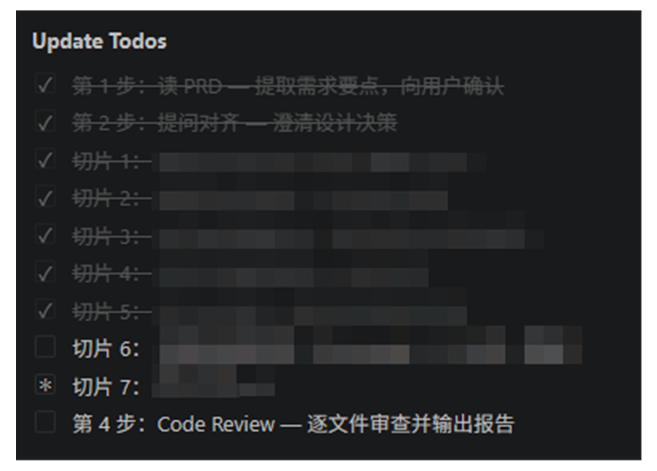

# codex-dev-workflow

**Stop vibe-coding from vague prompts.** A set of [Codex](https://github.com/openai/codex) plugins that give the agent an opinionated *spec-to-ship* workflow: it **grills your half-baked idea into a real PRD**, then drives it through plan → TDD → review → summary.

[](https://github.com/Today-Hbw/claude-code-dev-workflow/stargazers)
[](LICENSE)


English | [中文](#中文)

---

<!-- Drop a 15–25s GIF here. Recording script: docs/demo-script.md -->
<p align="center">
  
</p>

## Why

Most bad AI output isn't a coding problem — it's a **spec** problem. You hand the agent a fuzzy sentence, it happily builds the wrong thing, and you burn an hour finding out. These plugins put a process in front of the code:

- **forge-prd** interrogates your idea *before* a line is written — like a red team trying to find the hole in your requirement.
- **dev-flow** then carries that spec through a disciplined 8-step pipeline so nothing gets skipped.
- **dev-flow-lite** is the 4-step version for when you just need to move.

## Quickstart

```
/plugin marketplace add Today-Hbw/codex-dev-workflow
/plugin install forge-prd@codex-dev-workflow
/plugin install dev-flow@codex-dev-workflow
/plugin install dev-flow-lite@codex-dev-workflow
```

Then:

```
/forge-prd  <a rough idea, a screenshot, a PDF — anything>
/dev-flow   <path to the PRD you just forged>
```

## The plugins

| Plugin | What it does |
|--------|--------------|
| ⚒️ **[forge-prd](plugins/forge-prd)** | Forge — don't polish. Takes any raw material (a rough thought, image, PDF, HTML, MD) and **grills it in three escalating layers** until a clear, build-ready PRD falls out. |
| 🔁 **[dev-flow](plugins/dev-flow)** | The full **8-step** spec-to-delivery pipeline: read PRD → grill → Q&A record → tech plan → code (TDD) → self-test → code review → summary. Resumable, config-driven. |
| ⚡ **[dev-flow-lite](plugins/dev-flow-lite)** | The **4-step** version: read PRD → align → code → review. No docs, no resume — just momentum for small changes. |

## ⚒️ Spotlight: forge-prd

> **Forge, not polish.** The requirement itself might be wrong — so the plugin attacks it like a red team before you build.

Three escalating layers of interrogation:

1. **Absorb** — reads all your material (MD / PDF / HTML / images); interprets images and asks you to confirm.
2. **Confirm understanding** — plays back *"what I think you want is X"* before going deeper.
3. **Three-layer grilling** — ambiguity → boundary → assumption, each layer gated by your confirmation.
4. **Output** — a structured `<name>.forged.md` you can hand straight to development.

## 🔁 Spotlight: dev-flow

An opinionated 8-step workflow Codex follows automatically, emitting standard docs at each stage:

| # | Step | Output | Key method |
|---|------|--------|-----------|
| 1 | Read PRD | requirement summary | scan + extract |
| 2 | Grill | questions + glossary | **decision-tree traversal** |
| 3 | Q&A record | `问答记录.md` | structured Q/A |
| 4 | Tech plan | `<task>/计划.md` | **agent-brief style** |
| 5 | Code | source files | **vertical slice + TDD** |
| 6 | Self-test | test report | behavior tests + checks |
| 7 | Code review | review notes | **verify-first** (run tests before reviewing) |
| 8 | Summary | `总结.md` | deliverable record |

Control flags: `--skip 5,6`, `--from 4`, `--only 3`, `--resume`, `--overview`. See [plugins/dev-flow](plugins/dev-flow).

## Star this repo ⭐

If this saved you an hour of rework, a star helps other Codex users find it.

## Credits

Design inspired by [mattpocock/skills](https://github.com/mattpocock/skills) and [anthropics/codex-plugins-official](https://github.com/openai/codex).

## License

MIT

---

## 中文

**别再用一句模糊的话去 vibe coding。** 一组 [Codex](https://github.com/openai/codex) 插件,给 agent 装上一套有主见的**"从需求到交付"工作流**:先把你半生不熟的想法**拷问成一份真正的 PRD**,再驱动它走完 规划 → TDD → 评审 → 总结。

[English](#codex-dev-workflow) | 中文

### 为什么

大多数 AI 产出的垃圾不是编码问题,而是**需求**问题。你丢给它一句模糊的话,它高高兴兴地把错的东西做出来,你花一小时才发现。这组插件在写代码之前先加一道流程:

- **forge-prd** 在你动笔前就质疑你的想法——像红队一样专找需求里的漏洞。
- **dev-flow** 再带着这份需求走完一条纪律严明的 8 步流水线,一步不落。
- **dev-flow-lite** 是 4 步简版,只想快速推进时用它。

### 快速开始

```
/plugin marketplace add Today-Hbw/codex-dev-workflow
/plugin install forge-prd@codex-dev-workflow
/plugin install dev-flow@codex-dev-workflow
/plugin install dev-flow-lite@codex-dev-workflow
```

然后:

```
/forge-prd  <一个粗略想法、一张截图、一个 PDF——什么都行>
/dev-flow   <你刚锻造出的 PRD 路径>
```

### 插件列表

| 插件 | 说明 |
|------|------|
| ⚒️ **[forge-prd](plugins/forge-prd)** | 锻造,不是打磨。把任何原料(粗略想法、图片、PDF、HTML、MD)**分三层递进强势拷问**,直到逼出一份清晰、可直接开工的 PRD。 |
| 🔁 **[dev-flow](plugins/dev-flow)** | 完整 **8 步**从需求到交付流水线:读 PRD → 拷问 → 问答记录 → 技术方案 → 编码(TDD) → 自测 → CR → 总结。可断点续传、配置驱动。 |
| ⚡ **[dev-flow-lite](plugins/dev-flow-lite)** | **4 步**简版:读 PRD → 对齐 → 编码 → 评审。不写文档、不续传,小改动直接冲。 |

### ⚒️ 重点:forge-prd

> **锻造,而非打磨。** 需求本身可能就是错的——所以插件在你动手前像红队一样攻击它。

四个阶段:

1. **吸收** — 读取所有素材(MD / PDF / HTML / 图片),主动解读图片并请你确认。
2. **理解确认** — 先复述"我理解你想要的是 X",大方向对了再深入。
3. **三层拷问** — 模糊层 → 边界层 → 假设层,每层结束由你确认才进入下一层。
4. **输出** — 一份结构化的 `<原名>.forged.md`,可直接交给研发。

### 🔁 重点:dev-flow

Codex 自动遵循的 8 步流程,每一步产出标准文档:

| # | 步骤 | 输出 | 关键方法 |
|---|------|------|---------|
| 1 | 读 PRD | 需求摘要 | 扫描 + 提取 |
| 2 | 拷问 | 提问 + 术语表 | **决策树遍历** |
| 3 | 问答记录 | `问答记录.md` | 结构化 Q/A |
| 4 | 技术方案 | `<任务>/计划.md` | **Agent Brief 风格** |
| 5 | 编码 | 代码文件 | **垂直切片 + TDD** |
| 6 | 自测 | 测试报告 | 行为测试 + 检查 |
| 7 | CR | 审查意见 | **验证前置**(先跑测试再审查) |
| 8 | 总结 | `总结.md` | 交付物记录 |

控制参数:`--skip 5,6`、`--from 4`、`--only 3`、`--resume`、`--overview`。详见 [plugins/dev-flow](plugins/dev-flow)。

### 点个 Star ⭐

如果它帮你省下了一小时返工,一个 star 能让更多 Codex 用户找到它。

### 致谢

设计参考 [mattpocock/skills](https://github.com/mattpocock/skills) 与 [anthropics/codex-plugins-official](https://github.com/openai/codex)。

### License

MIT
